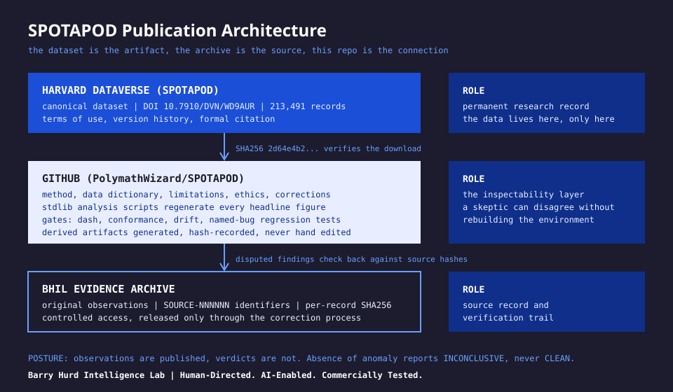
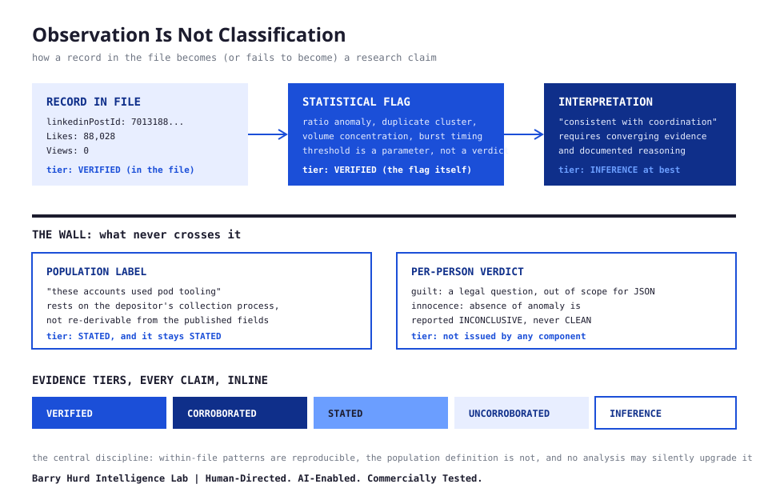
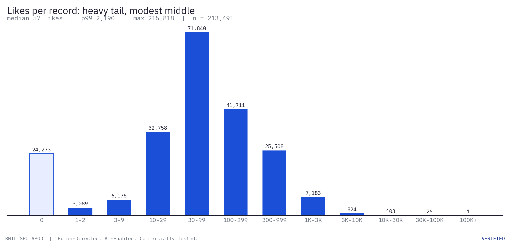
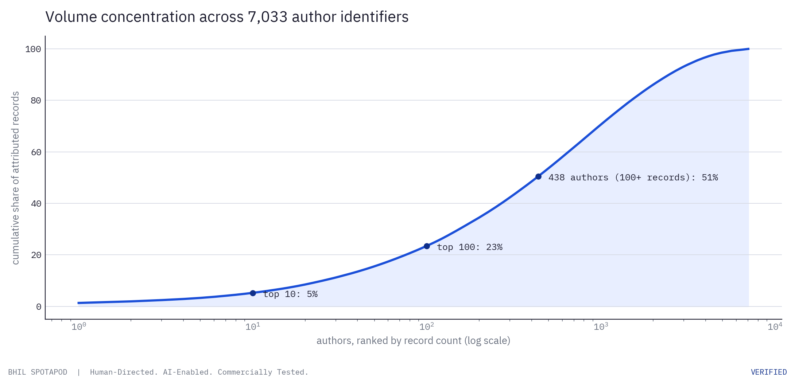
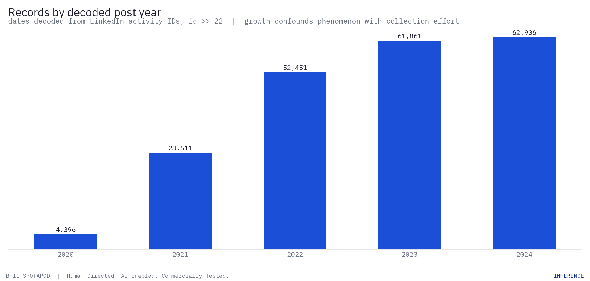
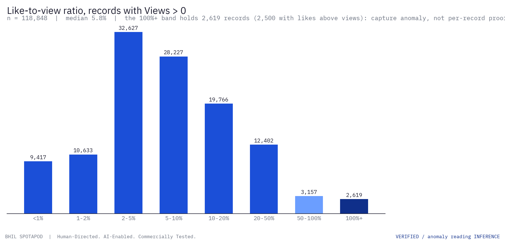
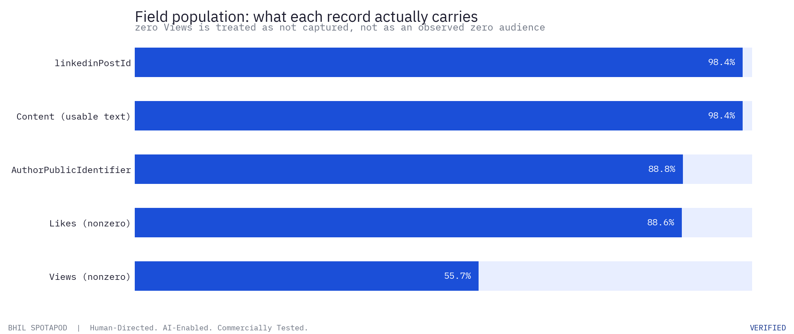
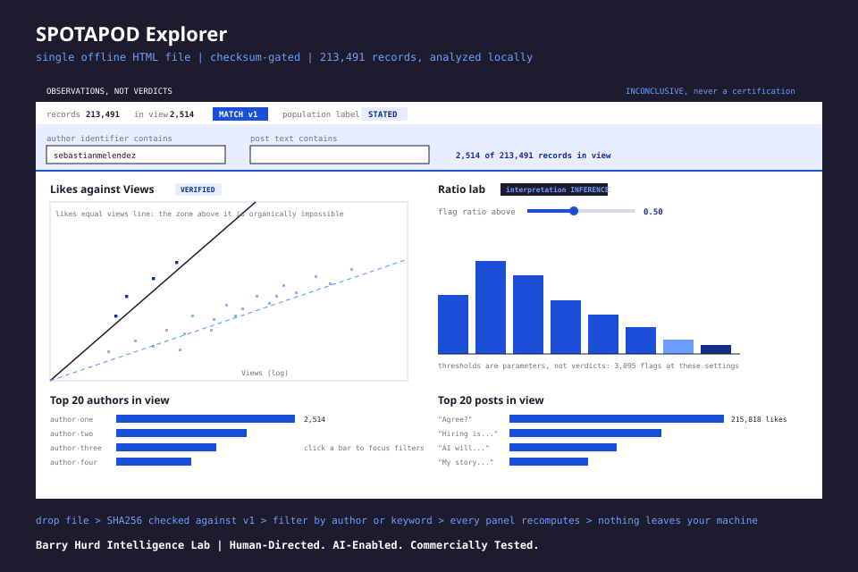

# SPOTAPOD

**Companion research repository for the SPOTAPOD engagement-pod dataset on Harvard Dataverse.**

Barry Hurd Intelligence Lab. Human-Directed. AI-Enabled. Commercially Tested.

---

## What this is

SPOTAPOD is a public research record built around a dataset of **213,491 LinkedIn post records** attributed to accounts observed using engagement-pod tooling (coordinated like and comment exchange platforms). Engagement pods manufacture social proof: members agree to boost each other's posts so the platform's algorithm treats the content as organically popular. The FTC's 2024 rule on fake indicators of social media influence (16 CFR Part 465) classifies the sale or purchase of fake engagement as a deceptive practice.

This repository holds everything except the data:

| Layer | Where it lives | What it contains |
|---|---|---|
| Canonical dataset | [Harvard Dataverse (SPOTAPOD)](https://dataverse.harvard.edu/dataverse/SPOTAPOD) | The data files, DOI `doi:10.7910/DVN/WD9AUR`, formal citation |
| Method and code | This repository | Methodology, data dictionary, limitations, ethics, analysis scripts, validators |
| Evidence archive | BHIL internal | Original observations, timestamps, source hashes |

That separation follows the [BHIL Data Publication model](method.md#the-public-data-trust-stack): the dataset is the research artifact, the evidence archive is the source record, and this repository explains the connection between them.

## The six-question test

A public dataset should let a skeptical researcher answer yes to all six:

1. **Can I see what was measured?** Yes: [Data dictionary](data-dictionary.md)
2. **Can I understand how it was measured?** Yes: [Method](method.md)
3. **Can I determine where the data came from?** Partially: see [Limitations](limitations.md) on provenance
4. **Can I reproduce the analysis?** Yes: [analysis/](https://github.com/PolymathWizard/SPOTAPOD/tree/main/analysis) scripts regenerate every headline figure
5. **Can I challenge the classification?** Yes: [Corrections process](corrections.md)
6. **Can I cite the exact dataset I examined?** Yes: DOI plus [checksums](https://github.com/PolymathWizard/SPOTAPOD/blob/main/checksums/CHECKSUMS.txt)

If all six hold, you do not have to trust BHIL. You can inspect the work yourself.

## What is in the data

Each record carries five fields: `linkedinPostId`, `Content`, `AuthorPublicIdentifier`, `Likes`, `Views`. Full definitions, null behavior, and type rules are in the [data dictionary](data-dictionary.md). Headline figures, all computed directly from the source file by [analysis/profile_dataset.py](https://github.com/PolymathWizard/SPOTAPOD/blob/main/analysis/profile_dataset.py):

- 213,491 records across 7,033 unique author identifiers (VERIFIED)
- Decoded post dates span 2018 to late 2024, concentrated 2021 to 2024 (INFERENCE, dates decoded from post IDs)
- 44.3 percent of records carry zero Views; 2,500 records show more Likes than Views (VERIFIED as data facts; interpretation in [Limitations](limitations.md))
- 26,098 records share identical non-empty text with at least one other record; the single word "Agree?" appears 3,918 times (VERIFIED)
- The full generated profile is in [docs/baseline-profile.md](baseline-profile.md)


## Visuals















Charts regenerate from the source file via [figures/generate_figures.py](https://github.com/PolymathWizard/SPOTAPOD/blob/main/figures/generate_figures.py) (matplotlib, BHIL brand tokens, drift-gated as derived artifacts). The two schema diagrams are authored SVG in the BHIL diagram register.

## Interactive Explorer



[explorer/spotapod-explorer.html](https://github.com/PolymathWizard/SPOTAPOD/blob/main/explorer/spotapod-explorer.html) is a single offline HTML file that turns the dataset into a live analysis environment. Download the JSON from Dataverse, open the file in a desktop browser, and drop the data on it: the tool hashes the file in your browser against the published v1 SHA256 before analysis begins, and nothing ever leaves your machine.

Global author and keyword filters drive every panel, and any author identifier in any table or chart is click-to-focus. Panels: overview data-quality stats, a likes-against-views log-log scatter with the likes-equal-views impossibility line and the median-ratio line of the current view, likes distribution, a ratio lab where the anomaly threshold and minimum-Views floor are sliders (thresholds are parameters, not verdicts), a decoded timeline, top 20 authors by records and top 20 posts by likes in view, per-author aggregates, cross-account duplicate content clusters, and a record browser.

The posture ships in the pixels: every panel carries its evidence tier chip, the STATED population label is pinned in the status bar for the whole session, and an empty flag table reports INCONCLUSIVE rather than certifying anything. Full guide: [the explorer guide](explorer.md).

## Start here

| You want to | Go to |
|---|---|
| Understand what the dataset is and is not | [Method](method.md) then [Limitations](limitations.md) |
| Look up a field definition | [Data dictionary](data-dictionary.md) |
| Find research questions worth asking | [Research questions](research-questions.md) |
| See who this data is useful for | [Use cases](use-cases.md) |
| Run the analysis yourself | [analysis/](https://github.com/PolymathWizard/SPOTAPOD/tree/main/analysis) (stdlib-only Python, no dependencies) |
| Explore interactively in a browser | [Explorer guide](explorer.md), offline single file, checksum-gated |
| Dispute a record about you | [Corrections](corrections.md) |
| Quick answers | [FAQ](faq.md) |

## Reproduce the baseline

```bash
# 1. Download the dataset from Harvard Dataverse (not included in this repo)
# 2. Verify the file
sha256sum podawaa2024_fixed.json
# expect: 2d64e4b274c1b238399a6b1d578b951cac9d5035a980ab70d4c3d66efffb4214

# 3. Regenerate the baseline profile
python3 analysis/profile_dataset.py /path/to/podawaa2024_fixed.json

# 4. Run the anomaly and concentration analyses
python3 analysis/engagement_anomalies.py /path/to/data.json --threshold 0.5 > anomalies.csv
python3 analysis/author_concentration.py /path/to/data.json --min-posts 20 > authors.csv
python3 analysis/duplicate_content.py /path/to/data.json --min-authors 2 > clusters.csv
```

All scripts are Python 3 standard library only. No pip installs, no environment files, no excuses.

## Evidence discipline

Every research claim in this repository carries one of five evidence tiers, inline:

- **VERIFIED**: computed directly from the published file, reproducible by anyone
- **CORROBORATED**: supported by two or more independent sources
- **STATED**: asserted by the depositor or a platform, not independently confirmed
- **UNCORROBORATED**: single-source claim awaiting confirmation
- **INFERENCE**: analytical conclusion, with the reasoning shown

The core provenance claim (that these posts came through engagement-pod tooling) is **STATED** by the dataset depositor and is not verifiable from the records themselves. That distinction is the spine of this whole repository. Read [Limitations](limitations.md) before drawing conclusions about any individual account.

No component of this project ever declares a record, account, or result CLEAN of manipulation. Absence of anomaly is reported as INCONCLUSIVE. See [Ethics](ethics.md).

## Citation

Dataset: Hall, Daniel. "LinkedIn posts using fake socials." Harvard Dataverse, 2026. `doi:10.7910/DVN/WD9AUR`

Companion repository: see [CITATION.cff](https://github.com/PolymathWizard/SPOTAPOD/blob/main/CITATION.cff).

## Credit

Dataset collection and deposit: Daniel Hall (Harvard Dataverse, SPOTAPOD). Companion methodology, documentation, tooling, and publication architecture: Barry Hurd, Barry Hurd Intelligence Lab. Publication model based on the BHIL guide "Where Do I Publish Data?". FTC rule reference: 16 CFR Part 465, Trade Regulation Rule on the Use of Consumer Reviews and Testimonials.

## License

Code and schemas: MIT ([LICENSE](https://github.com/PolymathWizard/SPOTAPOD/blob/main/LICENSE)). Documentation and derived content: CC BY 4.0 ([LICENSE-CONTENT](https://github.com/PolymathWizard/SPOTAPOD/blob/main/LICENSE-CONTENT)). The dataset itself is governed by the terms of use on its Harvard Dataverse record, not by this repository.

---

**Barry Hurd Intelligence Lab**

**Human-Directed. AI-Enabled. Commercially Tested.**
